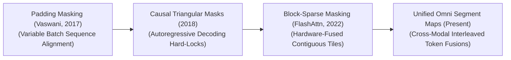

<!-- SEO: This repository provides a curated list of resources, variants, and applications for Attention Masks in AI Transformers. -->
# Awesome-Attention-Mask
## Attention Masks in AI: History, Progression, Variants, & Applications

An **Attention Mask** is a foundational structural tensor used in Transformer-based neural networks to dynamically control, restrict, and shape how individual tokens interact with one another during the self-attention calculation. Mathematically, the self-attention mechanism computes an $N \times N$ matrix of dot-product similarity scores between all Queries ($Q$) and Keys ($K$) across a sequence of length $N$ [INDEX: 1]. An Attention Mask intercepts this matrix right before the Softmax normalization step, injecting absolute negative infinity ($-\infty$) or a numerical bias value into targeted coordinate slots. 

Because $\exp(-\infty) = 0$, passed through the Softmax function, these masked positions drop to a probability weight of absolute zero. This effectively blindfolds specific tokens, forcing the network to selectively ignore padding noise, respect chronological time directions, isolate localized context windows, or enforce structural safety boundaries natively within its attention execution graphs.

---

## 🕰️ 1. The Macro Chronological Evolution

The technical implementation of attention routing has transitioned from rigid flat batch padding to causal triangular locks, hardware-fused block-sparse masks, and modern multi-modal interleaving sequence boundaries.

*   **The Variable-Length Padding Alignment Era (Vaswani et al., 2017)**
    *   *Concept:* The core structural baseline introduced during the genesis of the Transformer architecture [INDEX: 1]. Because GPUs demand rectangular, uniformly shaped dense matrices to compute parallel tensor mathematics efficiently, sequences inside a training batch must be stretched to match the longest sentence using empty `[PAD]` tokens. The **Padding Attention Mask** maps these indices, zeroing out their attention weights to ensure the network's parameters are never corrupted by nonsense padding padding noise.
*   **The Autoregressive Causal Hard-Lock Era (GPT Series, ~2018–2022)**
    *   *Concept:* Ported transformers out of bidirectional comprehension and straight into generative auto-regressive decoding. To train a decoder model to predict the next token, it must be strictly blocked from "cheating" by looking ahead at future answer strings. The **Causal Attention Mask** solves this by enforcing an immutable lower-triangular matrix boundary.
    *   *Limitation:* Heavy memory-bandwidth bound. Computing a full $N \times N$ matrix where nearly half the coordinates are discarded as upper-triangular zeros creates massive computational redundancy as context scaled.
*   **The Hardware-Fused Block-Sparse Masking Era (FlashAttention, ~2022–2024)**
    *   *Concept:* Re-architected masking logic to match the physical storage properties of GPU silicon layout. Pioneered by Tri Dao et al.'s **FlashAttention**, it replaces massive, flat software masks with block-wise tiling subroutines. 
    *   *Significance:* The mask constraint is fused directly into high-speed, on-chip GPU SRAM register loops. It skips loading, writing, or computing zero-weight blocks entirely, dropping memory overhead from quadratic bounds down to true linear scaling ($O(N)$) to unlock long-context token horizons.
*   **The Unified Multi-Modal Segment Enclave Era (~2025–Present)**
    *   *Concept:* The current modern state-of-the-art foundation standard. Driven by omni-directional architectures (such as GPT-4o or Claude 3.5 pipelines) that flatline pixels, acoustics, and strings into a single shared attention workspace [INDEX: 1].
    *   *Significance:* Implements complex, dynamic **Segment Attention Masks**. A single mask tensor handles multi-path logic simultaneously: allowing vision patch tokens to attend to each other bidirectionally, text tokens to read vision blocks cross-modally, and output strings to generate under strict causal chronological restrictions, preventing cross-modal information leakage natively.

---

## ⚙️ 2. Core Functional & Algorithmic Mask Variants

Attention masks are strictly categorized based on the geometric boundaries they enforce over the Query-Key probability distribution.

| Concept | Description | Year | Paper | Details |
|---|---|---|---|---|
| **Padding Attention Mask** | Mechanism: A 1D binary vector translated into a 2D matrix. It tracks the physical sequence lengths inside a mini-batch, injecting negative infinity into any coordinate slot corresponding to a trailing [PAD] token index. | 2017 | [Paper](https://arxiv.org/abs/1706.03762) | [Read More](./assets/pages/padding-mask.md) |
| **Causal / Lower-Triangular Mask** | Mechanism: Imposes a strict chronological arrow of time over token generation, setting the attention score to zero for all future indices where column position j > row position i. | 2018 | [Paper](https://cdn.openai.com/research-covers/language-unsupervised/language_understanding_paper.pdf) | [Read More](./assets/pages/causal-mask.md) |
| **Local / Sliding Window Attention Mask** | Mechanism: Restricts a token's attention field to a thin, localized neighborhood of adjacent tokens, masking out distant indices. | 2020 | [Paper](https://arxiv.org/abs/2004.05150) | [Read More](./assets/pages/sliding-window-mask.md) |
| **Prefix / Interleaved Segment Mask** | Mechanism: Tailored for instruction-following and Retrieval-Augmented Generation (RAG) structures. | 2021 | [Paper](https://arxiv.org/abs/2108.12409) | [Read More](./assets/pages/prefix-mask.md) |

---

## 🏗️ 3. High-Capacity Architectural & Token Masking Types

Depending on the operational constraints of the distributed supercomputing cluster, attention masks are customized to manage multi-document parsing and hardware synchronization boundaries.

*   **Document-Boundary Packing Masks (Flash-Decoding)**
    *   *Profile:* Slashes pre-training compute waste. To maximize token-per-second processing efficiency, engineers "pack" multiple short, completely separate user documents into a single massive 8k or 32k token context window chunk. The packing mask acts as an absolute information wall: it prevents document B from reading or attending to tokens belonging to document A, preventing cross-document data contamination completely.
*   **Instruction-Isolating XML Enclave Masks**
    *   *Profile:* Hardens defenses against prompt injection exploits. It applies a restricted masking policy over user-provided data inputs. By wrapping untrusted text inside immutable structural enclaves, the self-attention layers are physically blocked from allowing user text commands to override the developer’s system rules.

---

## 🏭 4. Production Engineering Challenges & Hardware Solutions

Deploying large-scale attention masking operations across high-concurrency cloud or edge serving infrastructures introduces critical tensor layout and memory bus constraints.

*   **The Non-Contiguous Fragmented Memory Core Stall**
    *   *The Problem:* Executing custom sparse or irregular attention masking layouts requires the GPU processor to fetch non-contiguous memory coordinates from slow global High Bandwidth Memory (HBM) repeatedly. This breaks the sequential caching bursts required by Tensor Cores, creating severe execution latency stalls during long generations.
    *   *Mitigation:* Transitioning entirely to **Block-Sparse Attention Masks**, ensuring that any sparsification layout operates strictly over block-aligned $64 \times 64$ or $128 \times 128$ dense matrix tiles that map contiguously inside GPU SRAM registers.
*   **The KV Cache Memory Inflation and VRAM Explosion Wall**
    *   *The Problem:* Maintaining unconstrained causal attention maps over ultra-long context windows (128k+ tokens) forces the system to store massive, multi-gigabyte Key-Value attention tensors concurrently. This quickly saturates VRAM, leading to cluster-wide system crashes.
    *   *Mitigation:* Combining paged memory managers with **Multi-Head Latent Attention (MLA)**, compressing the active cache dimensions down into low-rank latent vectors before mask execution to minimize memory footprints.

---

## 🚀 5. Frontier Real-World AI Industrial Applications

*   **Pre-Training Web-Scale Multi-Modal Foundational Transformers (GPT/Llama)**
    *   *Application:* Guides cluster-wide parameter initialization. Fused document-packing and multi-modal segment masks process text, code repos, and visual patches concurrently, allowing the model's parameters to internalize cross-sensory logic patterns smoothly without data leaks.
*   **Low-Latency Enterprise RAG Search & Text-to-SQL Engines**
    *   *Application:* Compresses model generation latencies within corporate endpoints. Prefix attention masking allows the system to cache and freeze the Key-Value states of massive corporate documentation catalogs, letting concurrent user queries read the data instantly with zero-shot retrieval delays.
*   **Secure Multi-Agent Tool Orchestration and Data Extraction**
    *   *Application:* Secures autonomous digital agents against malicious exploits. Instruction-isolating masks shield the model's primary function-calling layers; even if an agent reads a corrupted third-party PDF that contains a hidden injection command, the mask blocks the adversarial token from hijacking the system's execution privileges.

---

## 📚 References
1. Vaswani, A., et al. (2017). Attention is all you need: Foundational transformer masking matrix blocks. *Advances in Neural Information Processing Systems (NeurIPS)*, 30 [INDEX: 1].
2. Radford, A., et al. (2019). Language models are unsupervised multitask learners: Causal lower-triangular decoding parameters. *OpenAI Blog Monograph*.
3. Beltagy, I., Peters, M. E., & Cohan, A. (2020). Longformer: The long-document transformer via localized sliding window masking. *arXiv preprint arXiv:2004.05150*.
4. Dao, T., et al. (2022). FlashAttention: Fast and memory-efficient exact attention with IO-awareness via hardware-fused block-sparse tiling loops. *Advances in Neural Information Processing Systems (NeurIPS)*.
5. Ratner, N., et al. (2023). Packing training shards efficiently via document-boundary packed attention masks. *International Conference on Machine Learning (ICML)*.
6. DeepSeek-AI. (2025). DeepSeek-V3 Technical Report: Multi-head latent parallel attention and sharded masking topologies over distributed hardware clusters. *GitHub Repository Technical Infrastructure Manifesto*.

---

To advance this documentation repository, structural optimization setup, or MLOps deployment pipeline, consider exploring these adjacent development pathways:
* Build a **Python code snippet using PyTorch** illustrating how to construct a manual causal lower-triangular mask tensor and apply it to an input Query-Key dot product matrix.
* Generate a **comprehensive Markdown table** explicitly comparing Padding Masks, Causal Triangular Masks, Sliding Window Masks, and Document-Packing Masks across mathematical spatial granularities, computational time complexities, GPU VRAM caching footprints, and core operational targets.
* Establish a **performance evaluation harness using Triton** to track the exact computational token-per-second throughput and memory bus latency metrics achieved when compiling a fused block-sparse attention mask operation straight inside an active GPU register block.

***

**Follow-Up Options Matrix:**

Before updating this documentation repository workspace layout, let me know how you would like to proceed by choosing one of the options below:
* I can provide a **complete Python code boilerplate using PyTorch** demonstrating how to write an automated script that packs multiple variable-length text sequences into a single masked tensor block.
* I can generate a **Markdown matrix table** tracking the explicit block sizes, padding tokens, and context boundaries utilized by leading foundation repositories to execute high-concurrency cloud serving.
* I can write a detailed technical explanation focusing on the **mathematics of FlashAttention causal mask skipping** and how matrix slicing loops bypass zero-weight computations natively at the hardware layer.

