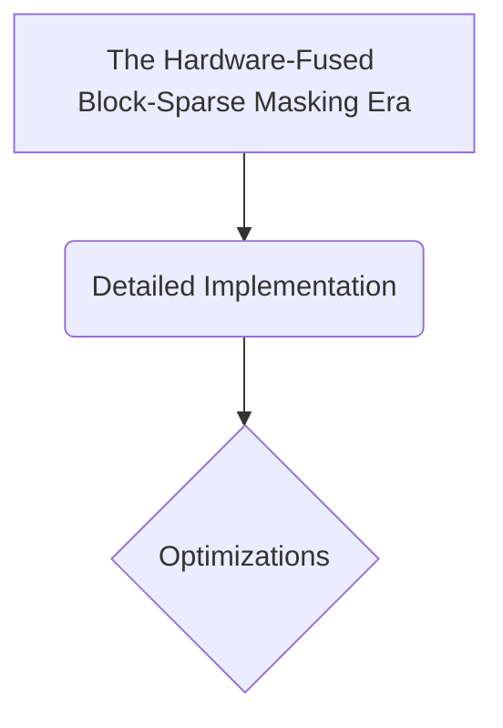

# The Hardware-Fused Block-Sparse Masking Era

## Overview
Re-architected masking logic to match the physical storage properties of GPU silicon layout. Pioneered by Tri Dao et al.'s FlashAttention, it replaces massive, flat software masks with block-wise tiling subroutines.

## Diagram

## Meta
- **Year**: 2022
- **Paper**: [Link](https://arxiv.org/abs/2205.14135)

[Back to README](../../README.md)