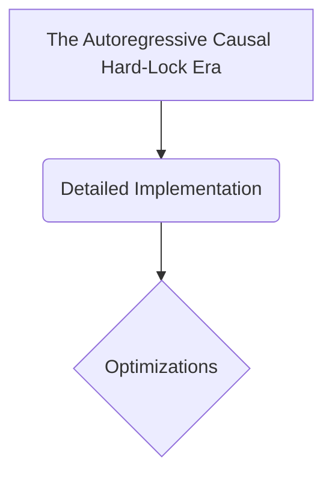

# The Autoregressive Causal Hard-Lock Era

## Overview
Ported transformers out of bidirectional comprehension and straight into generative auto-regressive decoding. To train a decoder model to predict the next token, it must be strictly blocked from cheating by looking ahead at future answer strings. The Causal Attention Mask solves this by enforcing an immutable lower-triangular matrix boundary. Limitation: Heavy memory-bandwidth bound.

## Diagram

## Meta
- **Year**: 2018
- **Paper**: [Link](https://cdn.openai.com/research-covers/language-unsupervised/language_understanding_paper.pdf)

[Back to README](../../README.md)