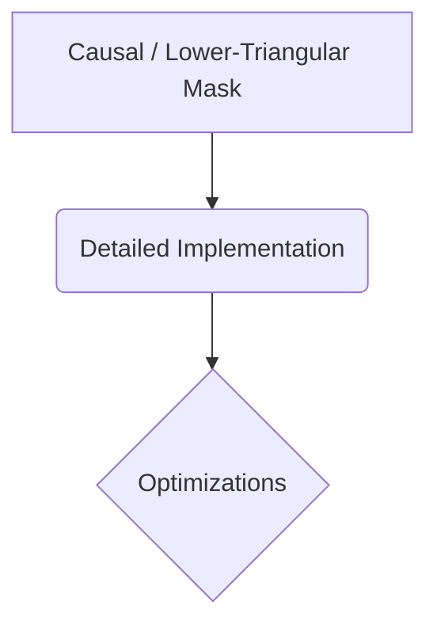

# Causal / Lower-Triangular Mask

## Overview
Mechanism: Imposes a strict chronological arrow of time over token generation, setting the attention score to zero for all future indices where column position j > row position i.

## Diagram

## Meta
- **Year**: 2018
- **Paper**: [Link](https://cdn.openai.com/research-covers/language-unsupervised/language_understanding_paper.pdf)

[Back to README](../../README.md)