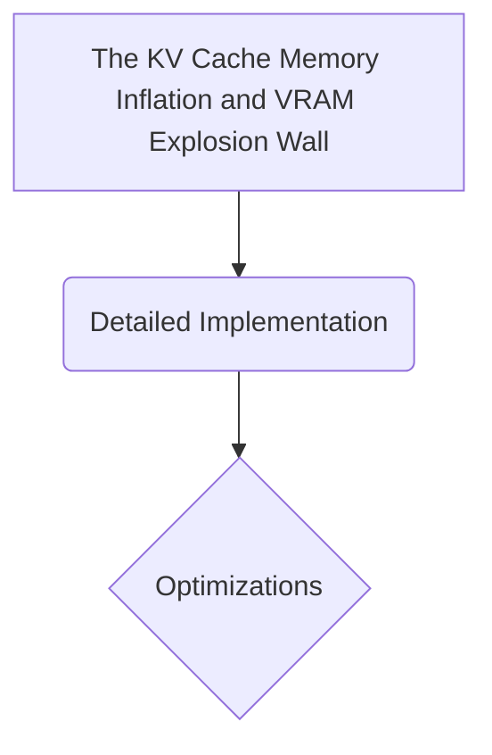

# The KV Cache Memory Inflation and VRAM Explosion Wall

## Overview
The Problem: Maintaining unconstrained causal attention maps over ultra-long context windows (128k+ tokens) forces the system to store massive, multi-gigabyte Key-Value attention tensors concurrently.

## Diagram

## Meta
- **Year**: 2023
- **Paper**: [Link](https://arxiv.org/abs/2309.06180)

[Back to README](../../README.md)