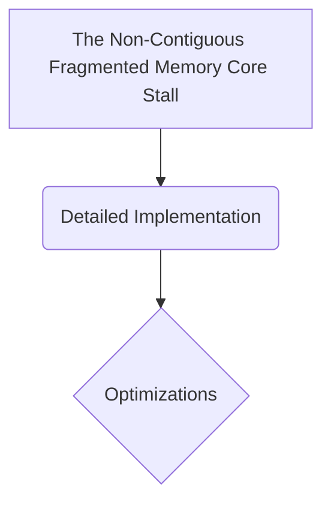

# The Non-Contiguous Fragmented Memory Core Stall

## Overview
The Problem: Executing custom sparse or irregular attention masking layouts requires the GPU processor to fetch non-contiguous memory coordinates from slow global High Bandwidth Memory (HBM) repeatedly.

## Diagram

## Meta
- **Year**: 2022
- **Paper**: [Link](https://arxiv.org/abs/2205.14135)

[Back to README](../../README.md)