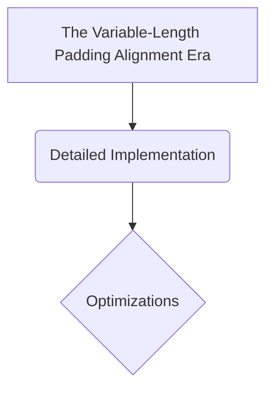

# The Variable-Length Padding Alignment Era

## Overview
The core structural baseline introduced during the genesis of the Transformer architecture. Because GPUs demand rectangular, uniformly shaped dense matrices to compute parallel tensor mathematics efficiently, sequences inside a training batch must be stretched to match the longest sentence using empty [PAD] tokens. The Padding Attention Mask maps these indices, zeroing out their attention weights to ensure the network's parameters are never corrupted by nonsense padding padding noise.

## Diagram

## Meta
- **Year**: 2017
- **Paper**: [Link](https://arxiv.org/abs/1706.03762)

[Back to README](../../README.md)