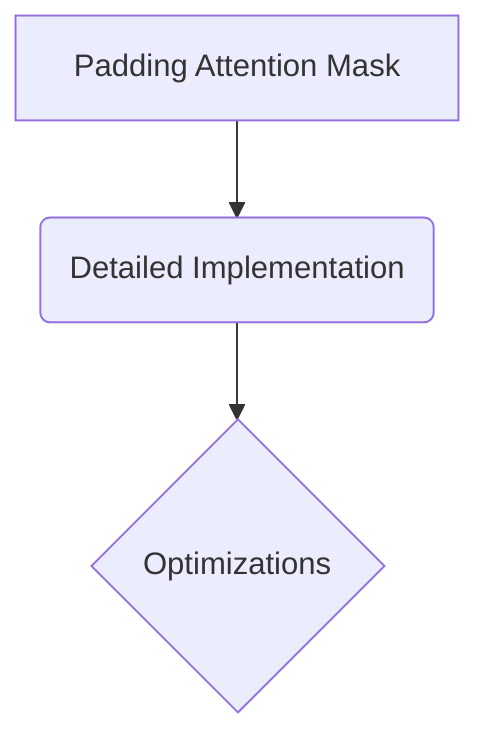

# Padding Attention Mask

## Overview
Mechanism: A 1D binary vector translated into a 2D matrix. It tracks the physical sequence lengths inside a mini-batch, injecting negative infinity into any coordinate slot corresponding to a trailing [PAD] token index.

## Diagram

## Meta
- **Year**: 2017
- **Paper**: [Link](https://arxiv.org/abs/1706.03762)

[Back to README](../../README.md)