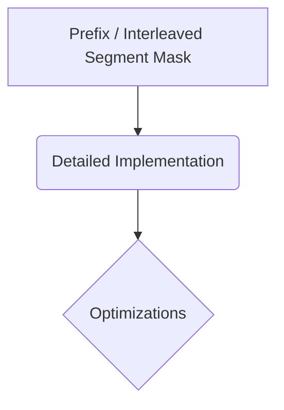

# Prefix / Interleaved Segment Mask

## Overview
Mechanism: Tailored for instruction-following and Retrieval-Augmented Generation (RAG) structures.

## Diagram

## Meta
- **Year**: 2021
- **Paper**: [Link](https://arxiv.org/abs/2108.12409)

[Back to README](../../README.md)