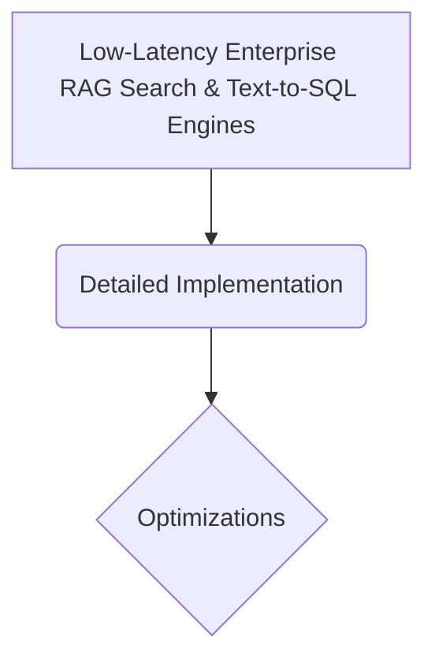

# Low-Latency Enterprise RAG Search & Text-to-SQL Engines

## Overview
Application: Compresses model generation latencies within corporate endpoints. Prefix attention masking allows the system to cache and freeze the Key-Value states of massive corporate documentation catalogs.

## Diagram

## Meta
- **Year**: 2023
- **Paper**: [Link](https://arxiv.org/abs/2307.03172)

[Back to README](../../README.md)