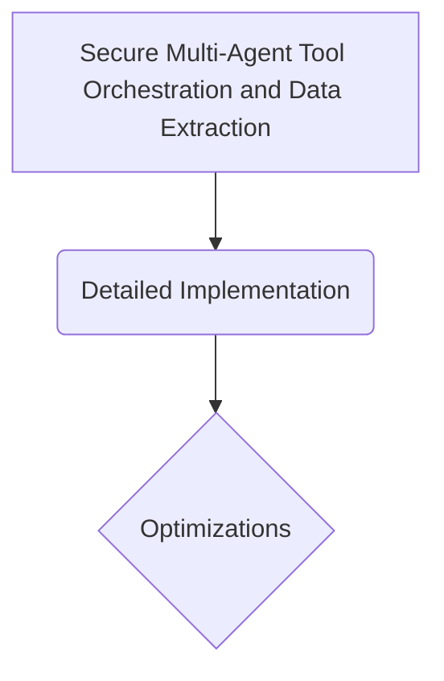

# Secure Multi-Agent Tool Orchestration and Data Extraction

## Overview
Application: Secures autonomous digital agents against malicious exploits. Instruction-isolating masks shield the model's primary function-calling layers.

## Diagram

## Meta
- **Year**: 2024
- **Paper**: [Link](https://arxiv.org/abs/2402.14830)

[Back to README](../../README.md)