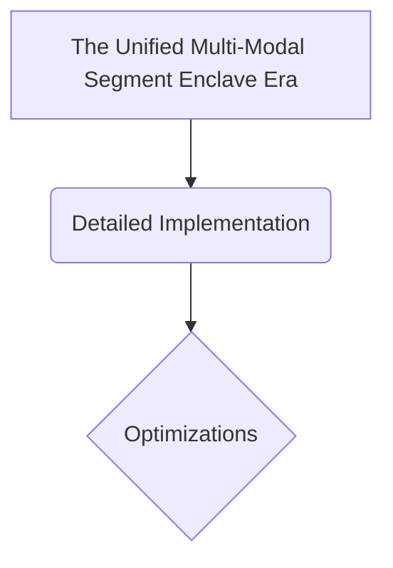

# The Unified Multi-Modal Segment Enclave Era

## Overview
The current modern state-of-the-art foundation standard. Driven by omni-directional architectures (such as GPT-4o or Claude 3.5 pipelines) that flatline pixels, acoustics, and strings into a single shared attention workspace.

## Diagram

## Meta
- **Year**: 2024
- **Paper**: [Link](https://arxiv.org/abs/2403.05530)

[Back to README](../../README.md)