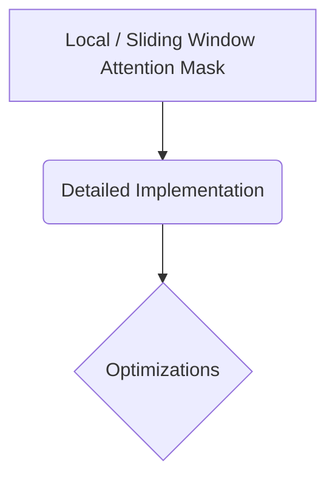

# Local / Sliding Window Attention Mask

## Overview
Mechanism: Restricts a token's attention field to a thin, localized neighborhood of adjacent tokens, masking out distant indices.

## Diagram

## Meta
- **Year**: 2020
- **Paper**: [Link](https://arxiv.org/abs/2004.05150)

[Back to README](../../README.md)