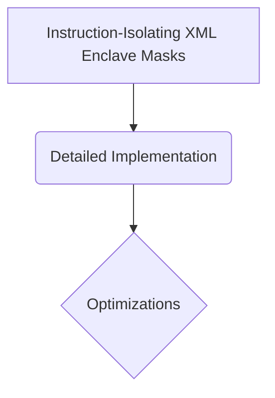

# Instruction-Isolating XML Enclave Masks

## Overview
Profile: Hardens defenses against prompt injection exploits. It applies a restricted masking policy over user-provided data inputs.

## Diagram

## Meta
- **Year**: 2024
- **Paper**: [Link](https://arxiv.org/abs/2405.00332)

[Back to README](../../README.md)